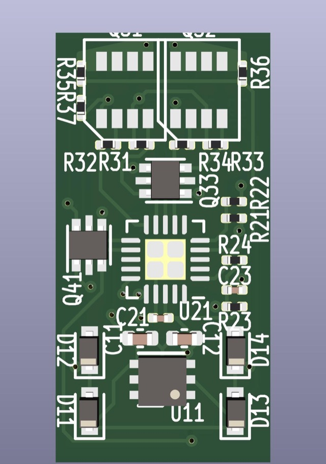

# Wired-N-1A-2-1

## About

The Wired-N-1A-2-1 design is a basic 1A N-Scale decoder based off the 
Breadboard-1 reference design.

* 1A Capacity
* 2 Functions (FOF, FOR)
* ICSP programming exposed via pads.
* Components on top side only enabling cheap fabrication.

## 3D Render

Actual size 9mm x 18mm:

## Intended Use Case

Used for any hard wired N/Z scale application, from locomotives
that do not support drop in decoders, to passenger car and caboose
lighting operations.

## Schematic

View the schematic: [Wired-N-1A-2-1.pdf](Wired-N-1A-2-1.pdf)

Supporting [CALCULATIONS.md](CALCULATIONS.md) discussions how component values were determined.

## Schematic Walkthrough

### Power Supply

Power from the two rails is fed into a bridge rectifier made up of
four discrete diodes D11-D14.  As DCC is a square wave, the output
is nearly but not quite continuous DC power with low ripple.  That
power is split off to drive the motor and functions directly, labeled
as Vdrive.  A linear regulator U11 is used to generate +5v for the
micro-processor, and has two support capacitors.

The project requirements for this design are to operate from 6v to 30v
of input.

### Micro-controller

A PIC18F06Q40 processor is used in this design due to it's avaialbility
in a 3mm x 3mm VQFN-20 package.  PIC processors require minimal
support components.  C21 is a local bypass capacitor that is placed
closed to the power pins.  C23 and R11 form a hold up circuit for
MCLR which must be kept high during normal operation.  If MCLR
drops, the chip will reset.

Particular notes on this part:

- This design does not use a Vref pin.

### H-Bridge

The H-Bridge controls the current to the motor.  It is driven by a PWM signal generated
by the micro-controller.  The software generates 4 PWM signals, P1A-P1D, which are used
to control speed and direction.

The H-bridge is simply 4 high power MOSFETs arranged in an H
configuration.  This design uses two discrete dual MOSFET chips
each with 1 PNP and 1NPN MOSFET, which is a common arrangement.
Resistors are placed on the gate inputs to prevent inrush from
damaging the micro-controller.

External diodes are omitted on this design to save space, the body
diode of the MOSFET must do the job.

In order to calculate BackEMF, a 100nf capacitor C31 is added to
reduce signal noise.  The resistors R35 and R36 then reduce the
voltage to an appropriate level for the analog input of the
micro-controller.  By monitoring this voltage the micro-controller
can calculate the load.

### Functions

This design supports functions F0F, F0R, F1-F6.

Functions F0F, F0R, and F1-F6 are designed to be connected to
external device in a "common anode" configuration.

Vdrive power is provided as a common anode source at both ends of
the board.  The MOSFET connects to ground when turned on by the
micro-processor.  A resistor is provided on the gate of each MOSFET
to manage inrush current.

### External Connectivity

MA & MB are the two motor connection solder pads.

RL & RR are the left and right rail solder pads.

F0F, F0R, & F0-F6 are the function solder pads.

CA are the Common Anode solder pads.

MCLR, +5, GND, PGD, PGD make up the ISCP connection points.
