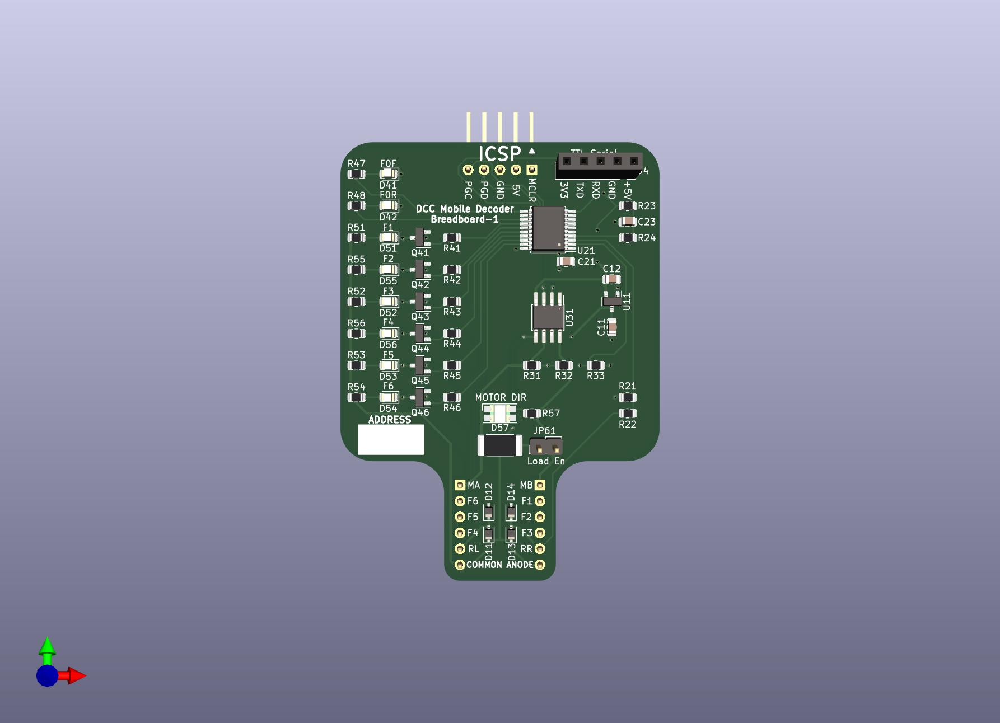

# Breadboard-1

## About

The Breadboard-1 design was created to make development of software as
simple as possible.  The design goals were:

* Serve as a "reference design" for a decoder such that other designs
  could largely be done by omitting unnecessary elements and selecting
  new components.
* Fit a standard 400 or 830 tie point breadboard.
* Have a connector for a PICKIT 4 or similar ICSP programmer.
* Operate over the full range of NMRA voltages to be scale independent.
* Have an easy to understand schmatic, suitable for teaching.
* Have an easy to understand PCB, suitable for teaching.
* Use low cost components.
* Include serial output capabilities for debugging and teaching.

## 3D Render

Actual size: 2" wide x 3" tall (not counting headers at top).

## Intended Use Case

It is expected that most users will connect the ICSP and Serial headers
to use the board for software development activities.  Users who do not 
need external components (e.g. motors, or external function devices) can
simply solder power wires to the RL and RR inputs.  Users who want to
connect external devices would likely populate J1 and J2 and plug the
board into a standard 400 or 830 point breadboard.  The exposed connections
allow testing things like grain-of-wheat bulbs for lighting effects.

Although this decoder is not specifically intended to go in a locomotive
it could be installed in one.  This may be particularly useful when developing
motor control code.

## Schematic

View the [Breadboard-1.pdf](Breadboard-1.pdf) schematic without
having to open KiCad!

The document [CALCULATIONS.xlsx](CALCULATIONS.xlsx) contains a worksheet
for each schematic block with all of the relevant calculations.

### Power Supply

This block takes power from the rails and rectifies it into a 
Vdrive DC source that can be used to drive the motor.  Then a
linear regulator is used to provide a stable Vdd for the micro-processor.

### Processor

A PIC18F06Q40 processor is used in this design.  PIC processors
require minimal support components.  It needs only one decoupling
capacitor and a circuit to hold up MCLR when running.  Due to the
expected repeated programming the MCLR hold up includes a diode
to protect the circuit from repeated high programming voltages.

The following pins are left in their default locations:

- PGD, PGC to ease programming connections.
- RX, TX, to ease serial connections.
- MCLR, Vdd, Gnd, cannot be moved.

All other connections were placed to make routing the PCB traces
simpler.

PIC18F06Q40T-I/SS, PIC18F06Q40-I/SS, and PIC18F06Q40-E/SS are all
functionally the same and differ only in thermal specifications and
packaging.

### DCC Signal

To input the DCC signal the voltage is first stepped down by R31/R32
as a voltage divider.  This puts the signal inside the gate voltage
range of the 2N7002 MOSFET, which then turns on/off the logic level
voltage.  This circuit depends on the weak pull up being enabled
on the input pin of the processor.

### H-Bridge

The H-Bridge controls the current to the motor.  It is driven by a
PWM signal generated by the micro-controller.  The software generates
4 PWM signals, P1A-P1D, which are used to control speed and direction.

The H-bridge is simply 4 high power MOSFETs arranged in an H
configuration.  Resistors are placed on the gate inputs of the
low side to prevent inrush from damaging the micro-controller.
The high side is driven by two digital transistors.  A digitial
transistor is a transitor with two built in biasing resistors,
which saves components on the board.

In order to calculate BackEMF 3 resistors, R53, R54, and R57 are
added.  At any point the motor is turning one of the upper reistors
will be tied to motor-ground, and one will be tied to motor voltage.
The bottom is always tied to ground.  This allows a BackEMF voltage
no matter which way the motor is spinning.  The resulting voltage
goes into an analog pin configured in ADC mode so the voltage can
be measured.

Capacitors C51 and C52 are added to prevent noise from the motor
backfeeding into the Vdrive power that might affect other components.

### F0F-F0R

Functions F0F (front headlight) and F0R (rear headlight) are driven
directly by the PIC.  In most designs these are fixed lights on the
circuit board, so the exact current draw is known in advance.  This
configuration also means the light intensity is not determined by
track voltage.

### Function Outputs

This design supports functions F1-F6.  Typically decoders support
2 or 4 functions in hardware.

Functions F1-F6 are designed to be connected to external device in
a "common anode" (positive) confuration.  They are driven by 2N7001
MOSFETs to provide the higher current these external sources may
need.  The 2N7001 is rated for 100ma.

Vdrive power is provided as a common anode source.  The MOSFET
connects to ground when turned on by the micro-processor.  A resistor
is provided on the gate of each MOSFET to manage inrush current.

### Diagnostic LEDs

An LED with resistor sized for track power are installed on F1-F6
so the user needs no external lights.  These would not be present
on a real decoder, and are in this design solely to assist with
the software development process.

For the motor output a bi-color Red/Green LED with an appropriate
resistor has been added across the motor output.  The color Red or
Green will indicate the motor direction, and the LED will vary in
intensity from the PWM drive of the motor.

### External Connectivity

Two 6-pin 0.1" (2.54mm) pin headers are provided for connectivity
to a standard bread board.  The board has been physically designed
to connect to the top of a bread board in positions 1-6 across the
middle.  In a typical decoder these would be exposed as solder pads
for wire connections.

At the top of the board J3 provides a 5 pin ICSP header.  It's
physical layout has been designed so that a PICKIT4 programmer can
be plugged in directly and will be face up at the top of the board.
In a typical decoder these would be exposed as test points or solder
pads to allow the board to be programmed via a pogo pin adapter.

A 6 pin female header (optional) using the standard pinout for many
"USB to TTL Serial" adapters has been included.  A typical decoder
would not include this port. For software development purposes this
port is configured as a serial port allowing the use of functions
like `printf` or `putc` in the code.  This allows the programmer
to extract more information during the code debugging phase.

A 7 pin header (optional) is also provided for connecting an oscilloscope.
The P1A-P1D motor driver outputs, DCC signal in, and BackEMF voltage are
all exposed on pins to make diagnostics easier.

### Dummy Load

When JP61 is installed a 100 Ohm resistor is connected to the motor
outputs.  This enables "readback" functionality without having a
motor connected, or generating a load on a command station when
increasing the speed without having a motor attached.

**WARNING** If the jumper is enabled, the voltge high enough, and
the motor speed high enough the resistor will get very hot and/or
burn out.  This is intended to enable read-back in service mode
only, and not as a dummy load for continuous operation.  Recommend
that jumper JP61 only be installed when performing service mode
work.
