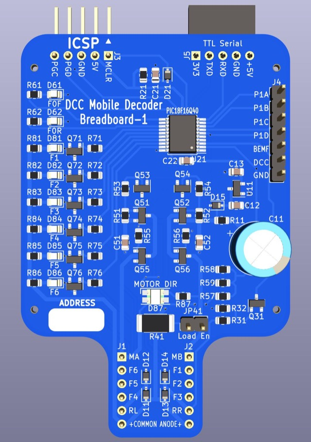

# Breadboard-1

## About

The Breadboard-1 design was created to make development of software as
simple as possible.  The design goals were:

* Fit a standard 400 or 830 tie point breadboard.
* Have a connector for a PICKIT 4 or similar ICSP programmer.
* Operate at a modest power level (generally similar to N sccale).
* Have an easy to understand schmatic, suitable for teaching.
* Have an easy to understand PCB, suitable for teaching.
* Use low cost components.
* Include serial output capabilities for debugging and teaching.

## 3D Render

Actual size: 2" wide x 2.75" tall (not counting pins at top).

## Intended Use Case

It is expected that most users would plug this device into a 400 tie point bread board,
connect an ICSP programmer like a PICKIT4, and power RL and RR from a DCC command station.

In this configuration the board can be used for software development purposes.  It will
allow software to be loaded onto the PIC, tested against a real DCC signal, and provide
visual confirmation of the actions being taken.

Functions are exposed to the breadboard so that alternative devices (e.g. grain of wheat
bulbs, alternative color/shape/intensity LEDs) can be connected and tested.

The motor is exposed to the breadboard so that an actual motor can be connected to test
motor drive logic.

## Schematic Walkthrough

View the [Breadboard-1.pdf](Breadboard-1.pdf) schematic without having to open KiCad!

## Supporting Material

* [CALCULATIONS.md](CALCULATIONS.md) discussions how component values were determined.
### Power Supply

Power from the two rails is fed into a bridge rectifier made up of
four discrete diodes D11-D14.  As DCC is a square wave, the output
is nearly but not quite continuous DC power with low ripple.  That
power is split off to drive the motor and functions directly, labeled
as Vdrive.  A linear regulator U11 is used to generate +5v for the
micro-processor, and has two support capacitors.

The project requirements for this design are to operate from 6v to 30v
of input.

### Micro-controller

A PIC18F06Q40 processor is used in this design.  PIC processors
require minimal support components.  C21 is a local bypass/decoupling
capacitor that is placed closed to the power pins.  C23 and R23
form a hold up circuit for MCLR which must be kept high during
normal operation.  If MCLR drops, the chip will reset.  R24 is
recommended by the datasheet to prevent chip damage when C23
discharges.

The following pins are left in their default locations:

- PGD, PGC to ease programming connections.
- RX, TX, to ease serial connections.
- MCLR, Vdd, Gnd, cannot be moved.

All other connections were placed to make routing the PCB traces
simpler.

PIC18F06Q40-I/SS, PIC18F06Q40T-I/SS, and PIC18F06Q40-E/SS are all functionally
the same and differ only in thermal specifications and packaging.

### H-Bridge

The H-Bridge controls the current to the motor.  It is driven by a
PWM signal generated by the micro-controller.  The software generates
4 PWM signals, P1A-P1D, which are used to control speed and direction.

The H-bridge is simply 4 high power MOSFETs arranged in an H
configuration.  Resistors are placed on the gate inputs of the
low side to prevent inrush from damaging the micro-controller.
The high side is driven by two digital transistors.  A digitial
transistor is a transitor with two built in biasing resistors,
which saves components in this design.

In order to calculate BackEMF 3 resistors are added.  At any point
the motor is turning one of the upper reistors will be tied to
motor-ground, and one will be tied to motor voltage.  The bottom
is always tied to ground.  This allows a BackEMF voltage no matter
which way the motor is spinning.  The resulting voltage goes into
an analog pin configured in ADC mode so the voltage can be measured.

Capacitors C31 and C32 are added to prevent noise from the motor
backfeeding into the Vdrive power that might affect other components.

### Functions

This design supports functions F0-F6.

Functions F0F (front headlight) and F0R (rear headlight) are driven directly by the PIC.
In most designs these are fixed lights on the circuit board, so the exact current draw is
known in advance.  The resistors are sized to limit the LEDs to approximately 5ma when
driven by the 5v output.

Functions F1-F6 are designed to be connected to external device in a "common anode"
confuration.  They are driven by 2N7001 MOSFETs to provide the higher current these
external sources may need.

Vdrive power is provided as a common anode source.  The MOSFET connects to ground when turned
on by the micro-processor.  A resistor is provided on the gate of each MOSFET to manage
inrush current.  An LED with resistor sized for track power are also installed so the
user needs no external lights.

### External Connectivity

Two 6-pin 0.1" (2.54mm) pin headers are provided for connectivity
to a standard bread board.  The board has been physically designed
to connect to the top of a bread board in positions 1-6 across the
middle.  In a typical decoder these would be exposed as solder pads
for wire connections.

At the top of the board J3 provides a 5 pin ICSP header.  It's
physical layout has been designed so that a PICKIT4 programmer can
be plugged in directly and will be face up at the top of the board.
In a typical decoder these would be exposed as test points or solder
pads to allow the board to be programmed via a pogo pin adapter.

A 6 pin female header (optional) using the standard pinout for many
"USB to TTL Serial" adapters has been included.  A typical decoder
would not include this port. For software development purposes this
port is configured as a serial port allowing the use of functions
like `printf` or `putc` in the code.  This allows the programmer
to extract more information during the code debugging phase.

A 7 pin header (optional) is also provided for connecting an oscilloscope.
The P1A-P1D motor driver outputs, DCC signal in, and BackEMF voltage are
all exposed on pins to make diagnostics easier.

### Diagnostic LEDs

This decoder is not designed to go into a locomotive.  It's purpose
is to teach about DCC, and to enable rapid software development.
Because it is unlikely to be in a locomotive, diagnostic LEDs have
been added to F1-F6 and also the motor output.

For F0-F6 an appropriate LED + Resistor has been added so that there
is a visual indicator if a function is on or off.

For the motor output a bi-color Red/Green LED with an appropriate
resistor has been added across the motor output.  The color Red or
Green will indicate the motor direction, and the LED will vary in
intensity from the PWM drive of the motor.

### Dummy Load

When JP61 is installed a 100 Ohm resistor is connected to the motor outputs.  This
enables "readback" functionality without having a motor connected, or generating a
load on a command station when increasing the speed without having a motor attached.

Power dissipated 

If a real motor is attached, JP61 should be left open.
