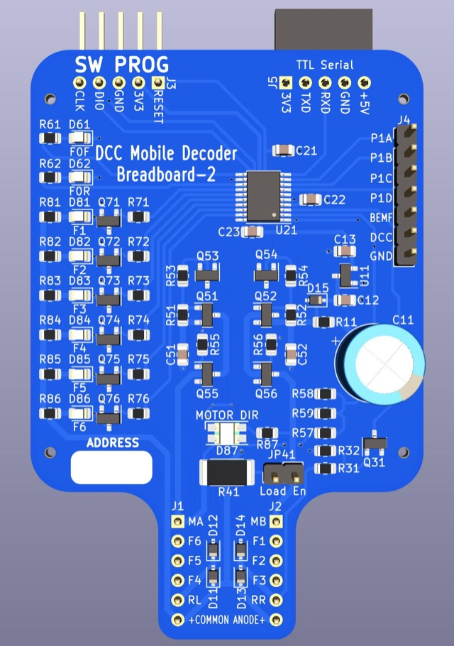

# Breadboard-2

## About

The Breadboard-2 design was created to make development of software 
for a STM32 microcontroller as simple as possible.  The design goals were:

* Serve as a "reference design" for a decoder such that other designs
  could largely be done by omitting unnecessary elements and selecting
  new components.
* Fit a standard 400 or 830 tie point breadboard.
* Have a connector for a SW programmer.
* Operate over the full range of NMRA voltages to be scale independent.
* Have an easy to understand schmatic, suitable for teaching and that
  can be used as a basis for scale-specific decoders.
* Have an easy to understand PCB, suitable for teaching.
* Use low cost, over-specd, highly available, and easy to replace components.
* Include serial output capabilities for debugging.

## 3D Render

Actual size: 2" wide x 3" tall (not counting headers at top).

## Intended Use Case

It is expected that most users will connect the SW PROG and Serial headers
to use the board for software development activities.  Users who do not 
need external components (e.g. motors, or external function devices) can
simply solder power wires to the RL and RR inputs.  Users who want to
connect external devices would likely populate J1 and J2 and plug the
board into a standard 400 or 830 point breadboard.  The exposed connections
allow testing things like grain-of-wheat bulbs for lighting effects.

Although this decoder is not specifically intended to go in a locomotive
it could be installed in one.  This may be particularly useful when developing
motor control code.

## Schematic

View the [Breadboard-2.pdf](Breadboard-2.pdf) schematic without
having to open KiCad!

The document [CALCULATIONS.xlsx](CALCULATIONS.xlsx) contains a worksheet
for each schematic block with all of the relevant calculations.

