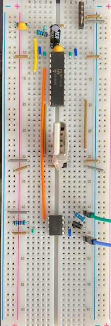

# Manual-1

Want to get started right now with parts that may be on hand?

The [Manual-1.pdf](Manual-1.pdf) schematic in this directory
contains a minimal design that can be implemented on a bread
board.  The project started with something like this originally,
you can too!

## Parts List

- Standard 800 tie point breadboard.
- Connecting Wires
- PIC18F16Q40-I/P Processor
  - Or a PIC18F16Q41-I/P Processor, it has one more peripheral that isn't used.
  - PIC18F06Q40 or PIC18F06Q41, both have 32k rather than 64 which may limit
    how much debugging can be turned on.
  - Or, many other PIC18F processors, the vast majority will work with slightly
    different pinouts and/or slightly different peripheral names and configurations
    in MPLAB.
    - PIC16F's are more than capable, and would run 98% the same code, one day
      we hope to have a PIC16F port too.  Maybe you can help?
- A 100nF (per the data sheet) and 10uF (not critical, use 1-20uF) for
  power decoupling.
- A 100nF capacitor (not critical, use 100nF-1uF) plus a 220 Ohm (not critical
  in the 100-500Ohm range), plus a 10K resitor to hold up MCLR.
- LEDs
  - Recommended are "5V LEDs, like Kingbright WP710A10GD5V.  These have an integrated
    resistor and can be connected directly from the output pin to ground making the
    bread board much neater.  They draw about 11-12ma at 5V.
  - Or, use any LED on hand with an appropriate resistor.  Use a resistor value that
    limits the current to 5-10ma, or the PIC can be overloaded when they are all on.
- A USB to TTL serial adatper.  We use this to get serial data to/from the processor
  for debugging, but also to power the circuit.
- A 6N137 opto-isolator, with a 2K resistor (not critical, 1K-4K), a 10K resistor,
  and a diode (type not critical).
  - Or use a 4N37, they aren't as fast but work fine here.  Connections are similar
    but slightly different.
- A PICKit 4 or similar programmer.

## Connecting it all up.

Here's a picture of how it looks on my bread board:

- In the upper right is a 5 pin header for connecting a PICKit4 programmer.
- In the upper left is the MCLR supporting logic.
- Above the PIC18F is a 100nf capacitor + 10uF capacitor for local decoupling.
- The USB-to-TTL serial adapter is in the middle, with 5v power and ground connected
  to the rails on both sides, and RX and TX connected to the PIC18F.
- The bottom is a 6N137 opto-isolator UPSIDE DOWN (pin one lower right), which makes
  my wiring neater.  On the left side is power, ground, and the pull-up.  On the
  right side is the input with a diode, a resistor, and clip leads that go off to
  my DCC command station.

For most programming work LEDs on the outputs are unnecessary.  They can always be
installed as-needed to troubleshoot particular behavior.

## DCC

The DCC input signal should generally be set for the N/Z voltage range, but HO will
work as well.  The input signal can be from the "rails" output, or from the 
"programming track" output depending on what aspect of the decoder is under test
or development.

One of the reasons the circuit is powered from the host computer and not the DCC signal
is so that the chip is already fully booted by the time any DCC signal arrives.  This
insures no messages are missed.

## Extending

There are no MOSFETs to drive loads.  A BS270 MOSFET is a good choice to drive higher
loads from the function outputs.  They support up to 400ma, but warning, you might
exceed the current the USB-to-TTL adapter can provide.  Check the manual!

There is no motor controller to drive a motor.  There are a variety of boards avaialble
online to be used in a bread board or stand alone that could be used.  MOSFETs, resistors
and a capacitor could be arranged similar to the Breadboard-1 circuit to drive a motor
as well.

This could be powered from the rails using a diode bridge and linear regulator that 
outputs 5v.  Make sure NOT to connect the USB-to-TTL 5v in that case, just RX, TX and
GND.  Better yet, use an opto-isolator.

## Debugging

What works for us is having MPLab running to edit code and program the chip.  In a separate
window a serial connection is kept open to receive debugging information back from the
printf statements.  Using printf does slow the code, it may miss messages, but that's generally
not a significant problem.
